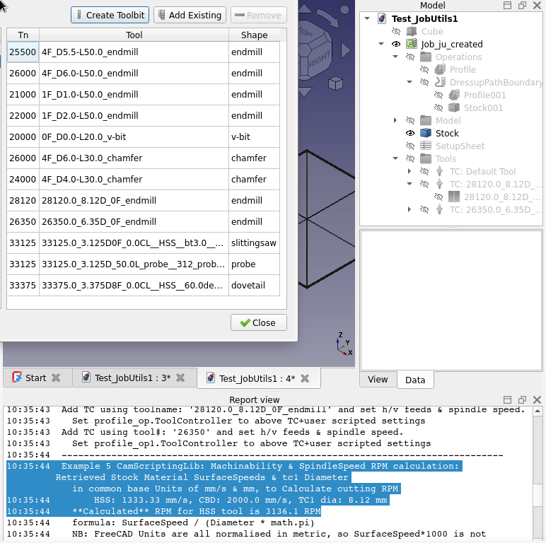

## CamScripts for FreeCAD CAM

CamScripts provides a suite of tools to streamline and automate most tasks within FreeCAD's Computer-Aided Manufacturing (CAM) environment. Key features and benefits include:

- Efficient Tool Management:

    - Import tool data from CSV files to create FreeCAD Tool libraries.
    - Use flexible naming rules and autonumbering for easy organization.
    - Generate tool families based on specific criteria.

- Process Automation:

    - Create and recreate every step of the CAM process, from tool creation to G-code generation.
    - Ensure consistent settings for tools, feeds, operations and postprocessors
    - Run sanity check report to review.

- Machinability Materials Integration:

    - Showcase a valuable dataset for common materials and highlight areas for further development.
    - Demonstrate speeds and feeds calculations using the newly released Machinability Materials.
    - Explore an extended Machinability model for improved data flexibilty and calculations.

CamScripts provides a valuable toolkit for FreeCAD users seeking to improve efficiency and consistency in their CAM workflows.



## Special mention:

1. An Extensive ToolBit rule based naming system which allows use of ANY ToolBit property and allows setting order of each component as well as leading/trailing seperators and abbreviations.

  - For example:
    - 2F-D6.35-L31
    - 1F_D3.0-L50.0_endmill
    - 3F_D4.0-L50.0_roughing
    - 28600.0_8.6D_0F_860_em
    - Last item above also shows one example of an auto-numbered name.

  - A ridulous example used for testing imported Tools with uncommon properties:
      - 30000.0_0.0D4F_0.0CL__HSS__60.0deg_0.0CL_54.2L_8.0ND_5.0NH_0.0DS_td5.0deg_dovetail__
      - 30000.0_0.0D0F_0.0CL__HSS__90.0deg_0.0CL_20.0L_0.0DS_td1.0deg_v-bit__v-bit
      - 40000.0_10.0D3F_0.0CL__HSS__60.0deg_0.0CL_30.0L_6.0DS_td5.0deg_chamfer__
        - Note double underscores included above show missing properties in a ToolBit do not cause errors.

2. FreeCAD CAM Speeds and Feeds calculation prototype example using the new Materials workbench and Material Machining Model containing the cutting data.

The cutting data is impressive due to it's coherence (for example data for different sections can be matched to related sections, which is a common failing in many data sets) and also because of the notes on adapting the parameters for many different cutting conditions.

I hope this example inspires many to contribute to the design work, further data collection, curation and documentation.

A proof of concept Machinability model that could allow users to add new Tool material and coating data, without requiring code changes to access and calculate Speeds and Feeds is also included.

So please consider reading and contributing to all aspects of this work. For example see the FreeCAD Materials forum [Material overhaul](https://forum.freecad.org/viewtopic.php?t=78242).

Example macro code is simplified by two supplied python libraries and one excellent JobUtils library from russ4262 and also includes sample code from imm and jbaehr and of course FreeCAD developers of CAM new Materials workbenches.

## Installing and using

CamScripts can be installed using the FreeCAD Addon Manager. LINK HOW>

It is installed as an Addon Workbench into the FreeCAD user's Mod directory, due to the number of scripts, libraries, rules files, CSV files and other support files.

The menu "CamScripts" is added the CAM Workbench and each feature is available from a sub-menu.

???File copy - manual or auto ...one/2 steps??? Questions/advice given on preferences???

A very recent development version of 22.0dev is currently required. Dates and features added on that date are listed below:

2024-08-24  wood cards with machining model   commit bb01ec7f7c7eb54cf72a8fd2583de94e5cd22981
2024-08-18  metal cards with machining model  commit 70bb45430d30cb61d08ac0e7291d1b9a0e931a48
2024-07-9   Machining model and materials     revision 38314
2024-02     CSV Import may work 2024-02 with  revision 32821, but this is untested.

This limitation is due to the extent lot of changes in FreeCAD migrating Path to CAM and many fixes and enhancements, in the since late 2023.

In addition the new Materials Workbench is undergoing extensive development and has been progressively enhanced during the second quarter 2024.


In addition features of the extended Machinability example for Vc and in particular Fz require a new material model and sample material with appropriate properites.

The extended model and material are included in [CamScripts/cutting_tool_data/Material]

materials stuff ***TODO** where get/install


Details of using each macro are in the following files and also within each macro, including some information on adapting to your needs.

Note: the 3x readme below are still WIP


## Background informatiion

### FreeCAD CAM Terminology:

ToolBitLibrary: provides way to manage many libraries each with many Tools

  - all organised/grouped as desired. eg Same TooBit can be in many Library-Tool-Tables.
  - each Library contains Tool Tables with ROWS of: Tn/Tool/Shape.

Tool-Bit = a cutting tool, with defined Shape properties:

  - including a property for the underlying Tool-Shape file
  - other Tool-bit Properties such as number of flutes.
  - The Tool-Bit shape is used in Operations and Simulators to "cut" the stock material to desired shape & size.
  - Tool-Shape file contains a sketch profile of cutting tool, with default Paramatised shape dimensions that are updated from Tool-Bit properties.

Job-ToolController has properties for Rapids, Feeds, Speed and contains copy of the Tool-Bit and shape used with all the specific sizes/properties.

### Machinability & CAM Speeds and Feeds

The early work using the new Materials Workbench to add a default group of "Machining" materials, includes 8 common metal and 5 wood(ish) materials, that have "Machinability" properties is demonstrated in the second script 'CamFullProcessExample.FcMacro' in "Example 5 CamScriptingLib: Job-Operation & TC props + Machinability data to calculate".

Cutting settings such as ToolController Diameter and ap or StepDown are retreived from the CAM-Job and other cutting data such as Vc or SurfaceSpeed etc is retrieved from the selected material.

One property not yet retrieved is ae or StepOver, as that is only available directly in some Operations, such as Pocket. In other Operations such as Profile this will require thought as to how this property should be managed.

If the ToolBit has Rake or Helix angle properties, then that data will be used instead of fixed defaults. This requires Tool shape files with those properties and the specific values. Some example files are included.

Another property with only a fixed example value in the default Example 5 is fz, commonly known as chipload.

Example output is shown below.
```
  ToolBit has no HelixAngle property, defaulting to 15°
  ToolBit has no RakeAngle to property, defaulting 30°
  material : AluminumWroughtAlloy
  RPM  13534 RPM
  electrical spindle power  0.942 kW
  Mc cutting torque 0.56494 Nm
  vf  1624 mm/min
  mrr  516 mm^3/s
```

Example 5 can also be extended with a different materials model, MachinabilityFz.yml, to store Vc and fz data. This model is more flexible , allowing users to simply add new Tools with different material and coatings and the detailed data, without require changes to the code.

To use the extension to example 5, requires installing the above model and sample material. Example 5 also needs to be changed to use the AlCastAlloyINHERITED+fz material. Then the new data will be used to retrieve Vc and Fz and the vf, the horizontal feed calculation will be improved with tool-material specific data, instead of a current example fixed value.

The proposed approach uses Materials arrays and a look up table to retieve the Tool Material name.

Also suggested is a way to simple store fz data as parameters from a linear or 2nd level polynomial regression of the data. This has benefit of not requiring interpolation later, and does allow for example using metric tools if you only have imperial sized tool data and vice versa, as well as any intermediate tool size not in the orignial data. Tool sizes outside the original data can also be used, but with more caution, especially for smaller tools approaching "micromilling"...wh8ich is a very loosely defined, but important concept.

The biggest advantage of plotting the fz data, is that it highlights errors, are more common than expected, even from very high end manufacturers, and also make it easier to compare data from other sources as well as more confidently tailor the data to your needs.

But does take some effort to setup, even with script support. Further automation of this task is on my long project list.

Note extended changes above change both the Machinability model and materials and provided example updates to CAM default shapes to hold the required Tool properties. This part of the work is entirely my own ideas and included purely to aid design thinking and feedback to FreeCAD.

Note: The cutting machinability data and calculated RPM are real, usable values, but are not yet matched with background information on the expected machine capability and limitations. For example is the cutting machine:
* a very rigid milling machine, with 20kW spindle @20,000 RPM (as seen in many tool catalogs)
* a commercial hobby machine, by comparison not as rigid & maybe 1kW spindle @10,000 RPM
* a DIY milling machine with even less capability & rigidity
* a commercial/DIY routing machine, great for timber, plastics, but stretched to cut metals
* one of the many types of 3040 Engraver have even less ability than above

Implied by above is the need to adapt the cutting parameters such as Spindle RPM to the situation.

This is also demonstrated in Tool catalogs by all of the footnotes and asterix and appendix that provide some guidance on how to change the cutting parameters for a wide variety of situations.

These catalogs usually state that the data is "starting values" or some "maximum values" and maybe other.....


## References and Credits

* FreeCAD Forum announcement/discussion [thread](https://forum.freecadweb.org/)
* Material forum in particular [Material overhaul](https://forum.freecad.org/viewtopic.php?t=78242)
* JobUtils.py Library Russ's lib Forum announcement/discussion [thread](https://forum.freecad.org/viewtopic.php?t=33328)

The third library provides many of the core Job features for `CamFullProcessExample.FcMacro` was created by FreeCAD forum user russ4262. It demonstrates the work he did to further open the CAM workbench to scripting and provides excelent example code is provided in this library in the Test## functions. Those examples have been extended here with many aded features to give the full scripted end to end CAM process.

Path and Material developers and forum users including russ4262, sliptonic, onekk, imm.


## Limitations, Feedback and Contributions

Minimum FreeCAD version required for the ?? macro to demonstrate Wood and Metal machinability materials with Speeds and Feeds calculations is:
Version: 0.22.0dev.38553 (Git)

See the github repo issues for latest information.

There are no checks while adding a ToolBit to the current Tool table to see if the ToolTable number or the Tool name already exist. Duplicates do occur with current test data and cause warning like:

```Tool number 28120 already exists for Tool 3F_D8.12-L50.0_endmill.```


## Release notes:

* V0.1  2024-08-31:
            - Initial release, fully functional, but not yet fully polished, no install process.
            - creates start to finish FreeCAD CAM process
            - demo of FreeCAD WIP Machinability materials properties and sample Speeds and Feeds calculations.
            - Extended machinability with Fz in equation form
            - csv Tool import
            - scripted tool bit creation


## License

JobUtils Copyright (c) 2023 Russell Johnson (russ4262) <russ4262@gmail.com>, see [JobUtils](JobUtils.py)

All other files in CamScripts are Copyright 2024 Spanner888 and is licensed under GNU GPL (v2+) license, see [LICENSE](LICENSE).
