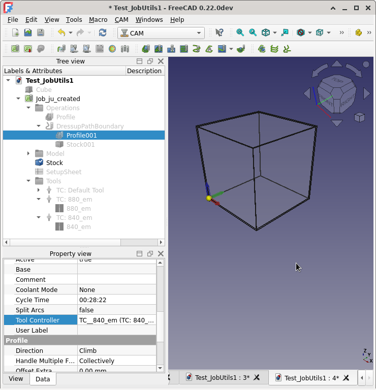

https://wiki.freecad.org/Package_Metadata
Tags: CAM, Library, ToolBits, Bulk, Create
Tags: CAM, All, Job, Operations, Library, ToolControllers, ToolBits, Materials, Calculate, Speeds, Feeds, Sanity, Report, Gcode
spanner888@usabledevices.com

addon mgr - gui seems "v incomplete"
    ...doing most data by hand
    BUT NOT ALL showing in addon mgr-dev mode
addon mgr - suggest read meta from "main" file ...gues style like JobUtils
but doesn't the XML override???

addon mgr CAN show readme & images......
so xml = search/sort & prob fallback if readme not found??

TODO - before/after...or just say empty before screen shot of Lib TB
TODO - screen shot of EXPANDED Job tree
TODO - MAYBE code snippet/full console output


# FreeCAD CAM process end to end scripting
scripting all features complete end to end process

The included libraries and FreeCAD macros provide examples of all CAM steps to create a Job, Operations, ToolControllers, Sanity report postprocessed gcode and calculate Spindle RPM from Tool and Stock material properties. Many key properties are set to provide realistic FreeCAD Job and gcode.


desc one liner or more?
>>>DECIDE - 1 or TWO releases...but refer each other!!!!!

Fully automated creation of:
One or many ToolBits and add to current Tool Library.

script 1: CamLibTbAddExample.FCMacro Provides {four/Five WIHT IMPORT??} examples of single and bulk creation of ToolBits and adding to the current tool Library.

There is also one support example to retrieve properties & attributes of all shape files in FC Tool- Shape directory. This enables a user to script any property of any existing shape.

This script uses the provided CamLibTbAdd.py library to streamline the example code.

script 2: CamFullProcessExample.FcMacro

Uses the JobUtils library by @Russ4262 to demonstrate a wide range of FreeCAD CAM features.
It also adds examples that:
a) complete fully scripted CAM Job creation from start to end, including setting many properties for Job, Operations, ToolControllers and running Sanity & Postprocessing the gcode
b) calculate Spindle RPM from material-machinabilty and tool data. This is a simple example of early design work by Material and CAM workbench developers.

**MACHINABILITY/SF RPM**

here/below:
Example 1-4 all JobUtils. #4 is extended by adding setting TC properties & to desired Op.
Examples 5 & 6 are from included CamScripting....
Examples are all compiled together in one script, to show how a typical start to end order that a FreeCAD might be fully automated.

Script appear long at first glance but well over half the content is support for setting properties, printing some Example header information and licence etc.
The actual code to go from creating a moderately complicated Job, set a lot of properties for Job, Operations, ToolControllers and to run Sanity & Postprocess is relatively short.

The script uses the provided CamScripting.py library and also JobUtils.py (written by Russ4262) library to streamline the example code.

This script also can be used to test the newly created ToolBits from the CamLibTbAddExample.FCMacro script.

Sanity report and the gcode.

Job, Ops, ToolBits and add to current Tool Library, gcode & sanity output...just not EVERY Op & Dressup ATM

++Key properties are set, including Job..., Op-TC
The ToolController for each Operation and key properties.....

Features of JobUtils that are not demonstrated here are:
set_job_origin_to_point

How to use each example is in [Doco/instructions/Usage]

## Speeds and Feeds Demo.
New Materials Machinability model is used to set Job-Stock material, then retreive Machinability SurfaceSpeeds.
Calculate the Spindle RPM for either HSS or Carbide, based on ToolController.Tool.Material property. Note this is an existing ToolBit property, not a new Material object.

This a demonstration of the very early work to design Speeds and Feeds for FreeCAD. SEE XXXXX
In future the ToolController material, might be set via a "new Material", depending on how we all decide to progress Speeds and Feeds.


# Installation & Doco/instructions/Usage

Install via the Addon manager in the macros section.

??Manual Installation:
Get from either of these locations below and copy content the folder into your FreeCAD macro directory.
Location: [forum thread ++TITLE??](https://forum.freecadweb.org/viewtopic.php?f=3&t=60818)
Location: [Development repo FIX URL](https://github.com/shaise/FreeCAD_SheetMetal)

???content/files:  <<GET FROM ADDON MGR package.xml ...or make sure both agree!!!
FEATURES depends again of 1 or 2 sep releases!!!
uiashfhsadn: 1x Library NAME supplied
uiashfhsadn: 1x Library NAME supplied and depends

# Example Use
One example file is provided for each library, each containing several examples.

Both example files provide full automation, ie once user has set desired properties and actions, running each script requires no further user interaction.

## CamLibTbAdd Library
Example code is simple and focussed entirely on creating ToolBits (a file in the Bit directory)
and adding each ToolBit to the current ToolLibrary.

All examples show how to set all standard EndMill properties.
??How to get for other shapes <<<HAVE CODE FOR THAT in the lib????
add example ...if so cahnge wording above.

# Doco/instructions/Usage:
Set desired....ops, TC & which TC for which Job

script does everything
comment out/remove...
No need to create document or load any workbench.
Script creates an empty document, if no document already open,
  no changes are made to the document.

ToolBits are added to the current Tool Library.
Existing Toolbit file of same name will be overwritten.
Existing Tools in Library will NOT be overwritten,
    a new Tool will be added with same or partially same properties.


## Example 1. Add single example default endmill to current Library.

## Example 2. Add SINGLE Tool 6.35 mm dia to current library

## Example 3. Create range of tools from dia to dia_max, incrementing dia by dia_inc
   But only If BOTH dia_max & dia_inc are greater than zero,
           Else: ONLY create ONE TB of this dia in current library.

## Example 4. Retrieve properties & attributes of all shape files in FC Tool- Shape directory.
By default this example is disabled.
Change the value of getDefaultShapeAttrs to True and save the macro to run this example.
These can be used to create different types of ToolBits above.
Get FreeCAD Default shape directory & list of shape names in dir.

At present, customising the ToolBit or Library Tool numbering schemes will require editing the CamLibTbAdd Libray.

??TODO Import example??

Examples of how to add a ToolBit to a CAM Job ToolController and set which Operation uses a ToolController are contained in the [CamScripting Library]

## CamScripting Library
This library uses the excelent ....,
++extends the example provided to set several Job and Operation parameters, including Operation ToolController.

In addition
demo of new materials machinability use to calcualte spindle RPM
Creates and saves a CAM Sanity Job check report.
Creates and saves gcode for the job.

Note: First execution time using CamLibTbAddExample.FCMacro and it's two libraries can be up to 10 times longer eg 40 seconds, vs 4 seconds on my 12 year old laptop.

#Example output


```
19:38:25  Adding ToolBit Shape: endmill Name: 20820default_em, #20820.0, Dia: 8.2 mm
19:38:25  ...finished.
19:38:25
19:38:25  Adding ToolBit Shape: endmill Name: 20635em, #20635.0, Dia: 6.35 mm
19:38:25  ...finished.
19:38:25
19:38:25  ToolBit diameters to be created:  [8.2 8.4 8.6 8.8 9. ]
19:38:25  Adding ToolBit Shape: endmill Name: 820_em, #20820, Dia: 8.2 mm
19:38:25  Adding ToolBit Shape: endmill Name: 840_em, #20840, Dia: 8.4 mm
19:38:25  Adding ToolBit Shape: endmill Name: 860_em, #20860, Dia: 8.6 mm
19:38:25  Adding ToolBit Shape: endmill Name: 880_em, #20880, Dia: 8.8 mm
19:38:25  Adding ToolBit Shape: endmill Name: 900_em, #20900, Dia: 9.0 mm
19:38:25  ...finished.
```




```
19:43:01  Job Utilities 2024-02-25 module imported
19:43:01  --------------------------------------------------------------------------------
19:43:01  Example 1 JobUtils: New doc & Job, optionaly clear report/python panes.
			 Active document is Test_JobUtils with Job object
19:43:06  Example 2 JobUtils: Add profile operation to specified job.
			 adding profile operation using top face, Face6.
19:43:06  Example 3 JobUtils: Add profile operation & Boundary Dressup to specified job.
		 adding profile operation
19:43:06  adding boundary dressup on profile operation
19:43:06  --------------------------------------------------------------------------------
19:43:06  Example 4 JobUtils: Add ToolControllers to Job-Tools & desired Operation.
		 JobUtils... Available tool files:
19:43:06       1 ::   5mm_Endmill
19:43:06       2 ::   5mm_Drill
19:43:06       3 ::   6mm_Ball_End
19:43:06       4 ::   6mm_Bullnose
19:43:06       5 ::   60degree_Vbit
19:43:06       6 ::   45degree_chamfer
19:43:06       7 ::   slittingsaw
19:43:06       8 ::   probe
19:43:06       9 ::   5mm-thread-cutter
19:43:06       20820.0 ::   20820default_em
19:43:06       20635.0 ::   20635em
19:43:06       20820 ::   820_em
19:43:06       20840 ::   840_em
19:43:06       20860 ::   860_em
19:43:06       20880 ::   880_em
19:43:06       20900 ::   900_em
19:43:06
19:43:06  Add TC using toolname: 880_em and set h/v feeds & spindle speed.
19:43:11  	Set profile_op.ToolController to above TC+user scripted settings
19:43:11  Add TC using tool#: 20840 and set h/v feeds & spindle speed.
19:43:11  	Set profile_op1.ToolController to above TC+user scripted settings
19:43:15  --------------------------------------------------------------------------------
19:43:15  Example 5 CamScripting: Machinability & SpindleSpeed RPM calculation:
		 Retrieved Stock Material SurfaceSpeeds & tc1 Diameter
			in common base Units of mm/s & mm, to Calculate cutting RPM
19:43:15  		HSS: 2916.67 mm/s, CBD: 6483.33 mm/s, TC1 dia: 8.8 mm
19:43:15  	**Calculated** RPM for HSS tool is 6330.0 RPM
19:43:15  	formula: SurfaceSpeed / (Diameter * math.pi)
19:43:15  	NB: FreeCAD Units are all normalised in metric, so SurfaceSpeed*1000 is not required.
19:43:15  Calculated SpindleSpeed RPM has not been set in ToolController SpindleSpeed.
19:43:15  You can do this manualy, or uncomment code in line below this print statement in the macro.
19:43:15  --------------------------------------------------------------------------------
19:43:15  Example 6 CamScripting: Create & save: CAM Sanity check report & Postprocessed gcode.
		 Processing file outputs: Sanity Job common errors report & PostProcess Gcode
19:43:16  Sanity check report written to: /home/spanner888/Documents/cam_sanity/sanity_auto.html
19:43:16
19:43:17  Post Processor: script_module postprocessing...
19:43:17  Done postprocessing.
19:43:17  File written to /home/spanner888/Documents/_source/_APPS/FC_wkly_38334/squashfs-root/appd_mlappy/Test_JobUtils1_Job_ju_created____0.ngc
19:43:19  --------------------------------------------------------------------------------
```


# Terminology
## FreeCAD CAM Tools/Bits/Shapes/Library Job-TC ++ for ju - Ops/materials/SF...
so sev sections????

# related FreeCAD CAM Terminology:
ToolBitLibrary: provides way to manage many libraries each with many Tools
  all organised/grouped as desired. eg Same TooBit can be in many Library-Tool-Tables.
  Each Library contains Tool Tables with ROWS of: Tn/Tool/Shape.
Tool-Bit = a cutting tool, with defined Shape properties,
      including a property for the underlying Tool-Shape file
      & other Tool-bit Properties such as number of flutes.
      The Tool-Bit shape is used in Operations and Simulators to
      "cut" the stock material to desired shape & size.
Tool-Shape file contains a sketch profile of cutting tool,
  with default Paramatised shape dimensions,
  that are updated from Tool-Bit properties.
Job-ToolController has properties for Rapids, Feeds, Speed
  and contains copy of the Tool-Bit used with all the specific sizes/properties.

#### References
* FreeCAD Forum announcement/discussion [thread](https://forum.freecadweb.org/viewtopic.php?f=3&t=60818)
* JobUtils.py Library Russ's lib Forum announcement/discussion [thread](https://forum.freecadweb.org/viewtopic.php?f=3&t=60818)
...all the materials

#### Release notes:
* V0.001  11 Jun 2015:  Initial version

alt format watch #### /### indents!!!
### 1.97
* accept PR from mario52
* set fixed width for some elements to prevent them getting too wide at times
* change backup file name formatting

## License
LGPL-2.1-or-later (see [LICENSE](LICENSE))
