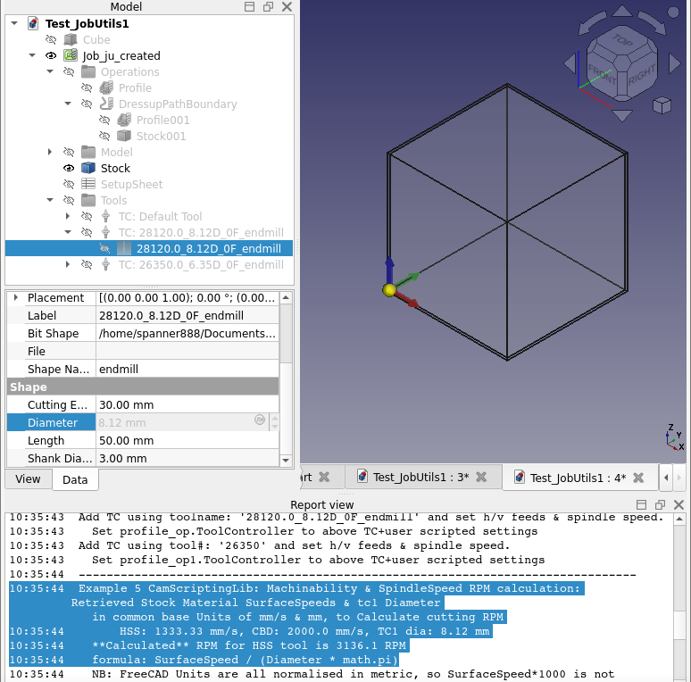

script = Menu name
CamScripts_2TbAddExample.FCMacro
CamTbAddExample.py

CamScripts_4READMEs.FcMacro
CamScripts_5Setup_CustomToolShapes.FcMacro
CamScripts_6Setup_CustomMaterialCfg.FcMacro


Script will add ToolBits to the CURRENT CAM Library Tool Table.
So make sure you have the desired Tool Table active BEFORE you run script.
It is probably best to create a test Table so to avoid cluttering your existing data!


CamTbAddExample has seven examples of creating ToolBits in code and using the above naming rules.

DETAILS or explain code location.....


Example 1. Add single example default endmill to current Library.

Example 2. Add SINGLE Tool 6.35 mm dia to current library

Example 3. Create range of tools from dia to dia_max, incrementing dia by dia_inc
   But only If BOTH dia_max & dia_inc are greater than zero,
           Else: ONLY create ONE TB of this dia in current library.

Example 4. Retrieve properties & attributes of all shape files in FC Tool- Shape directory.
By default this example is disabled.
Change the value of the line:

    ```getDefaultShapeAttrs = False```

to

    ```getDefaultShapeAttrs = True```

and save the macro to run this example. Then the shape dictionaries output in report pane can be used to create different types of ToolBits above.

An example is shown below:

```
{'shape': 'v-bit.fcstd', 'name': 'v-bit', 'parameter': {'CuttingEdgeAngle': 90.0 deg, 'CuttingEdgeHeight': 1.0 mm, 'Diameter': 10.0 mm, 'Length': 20.0 mm, 'ShankDiameter': 5.0 mm, 'TipDiameter': 1.0 mm}, 'attribute': {'Chipload': 0.0 mm, 'Flutes': 0, 'Material': 'HSS'}}
```

The output above includes all properties in the default shapes, as a patch suggested to fix missing properties has been applied locally. Details of the issue and a suggested fix have been submitted in FreeCAD/FreeCAD#15637.

FreeCAD CAM Tools/Bits/Shapes/Library Job-TC ++ for ju - Ops/materials/SF...

CHANGE TO ABOVE KISS FORMAT/DETAILS!!!!
so sev sections WITH Example NUMBERING????

## Example output



```
13:20:03  Examples 1 and 2 show different ways to create and name ToolBits.
13:20:03       ToolBits created are ALSO used in CamFullProcessExample as properties of tcProps1 & tcProps2,
13:20:03       and so these should not be changed, else CamFullProcessExample will fail.
13:20:03  Example 3 matches naming rules suggested by github user boboxx
13:20:03  Example 4 uses exagerated_rules_example, to show how dif properties only appear when present.
13:20:03  Example 5 add Shape name to RHS of boboxx rules.
13:20:03
13:20:03  Example 1. Create/Add SAME default endmill THREE timesEach time use a different way to name to ToolBit.    With and without using naming_rules. Default Name = dia_shape & #=1,    Finally naming with string value.
13:20:04  	Adding ToolBit Shape: endmill, Dia: 8.12 Name: 28120.0_8.12D_3F_endmill
13:20:05  	Adding ToolBit Shape: endmill, Dia: 8.12 Name: 8.12_endmill
13:20:06  	Adding ToolBit Shape: endmill, Dia: 8.12 Name: Example1_string_name
13:20:06  	...Example 1 finished.
13:20:06
13:20:06  Example 2. Add SINGLE Tool 6.35 mm dia to current library, shows all settings
13:20:07  	Adding ToolBit Shape: endmill, Dia: 6.35 Name: 26350.0_6.35D_4F_endmill
13:20:08  	...Example 2 finished.
13:20:08
13:20:08  Example 3. Create many tools: dia to dia_max, increment dia_inc
13:20:08  	ToolBit diameters to be created:  [8.2 8.4 8.6 8.8 9. ]
13:20:08  	Adding ToolBit Shape: endmill, Dia: 8.2 mm Name: 4F_D8.2-L50.0_endmill
13:20:09  	Adding ToolBit Shape: endmill, Dia: 8.4 mm Name: 4F_D8.4-L50.0_endmill
13:20:09  	Adding ToolBit Shape: endmill, Dia: 8.6 mm Name: 4F_D8.6-L50.0_endmill
13:20:09  	Adding ToolBit Shape: endmill, Dia: 8.8 mm Name: 4F_D8.8-L50.0_endmill
13:20:10  	Adding ToolBit Shape: endmill, Dia: 9.0 mm Name: 4F_D9.0-L50.0_endmill
13:20:10  	...Example 3 finished.
13:20:10
13:20:10  Example 4. For EVERY AVAILABLE Tool Shape: Create Diameter RANGE of Tools in current library
13:20:10             Care adjusting as #Tools created = #shapes * #Tool-in-dia-range
13:20:10             One test setup create over 1,600 ToolBits & added to Library!
13:20:11  	ToolBit diameters to be created:  [3.125 3.25  3.375]
13:20:11  	Adding ToolBit Shape: roughing_HRangles, Dia: 3.125 mm Name: 33125.0_3.125D2F_0.0CL__HSS__Forward__30.0CL_50.0L_3.0DS_roughing_HRangles__312_roughing_HRangles_example
13:20:11  	Adding ToolBit Shape: roughing_HRangles, Dia: 3.25 mm Name: 33250.0_3.25D2F_0.0CL__HSS__Forward__30.0CL_50.0L_3.0DS_roughing_HRangles__325_roughing_HRangles_example
13:20:11  	Adding ToolBit Shape: roughing_HRangles, Dia: 3.375 mm Name: 33375.0_3.375D2F_0.0CL__HSS__Forward__30.0CL_50.0L_3.0DS_roughing_HRangles__337_roughing_HRangles_example
13:20:13  	ToolBit diameters to be created:  [3.5   3.625 3.75 ]
13:20:13  	Adding ToolBit Shape: pcb corncutters, Dia: 3.5 mm Name: 33500.0_3.5D2F_0.0CL__HSS__50.0L_ta119.0deg_pcb corncutters__350_pcb corncutters_example
13:20:13  	Adding ToolBit Shape: pcb corncutters, Dia: 3.625 mm Name: 33625.0_3.625D2F_0.0CL__HSS__50.0L_ta119.0deg_pcb corncutters__362_pcb corncutters_example
13:20:13  	Adding ToolBit Shape: pcb corncutters, Dia: 3.75 mm Name: 33750.0_3.75D2F_0.0CL__HSS__50.0L_ta119.0deg_pcb corncutters__375_pcb corncutters_example
13:20:15  	ToolBit diameters to be created:  [3.875 4.    4.125]
13:20:15  	Adding ToolBit Shape: slotdrill, Dia: 3.875 mm Name: 33875.0_3.875D2F_0.0CL__HSS__Forward__30.0CL_50.0L_3.0DS_slotdrill__387_slotdrill_example
13:20:15  	Adding ToolBit Shape: slotdrill, Dia: 4.0 mm Name: 34000.0_4.0D2F_0.0CL__HSS__Forward__30.0CL_50.0L_3.0DS_slotdrill__400_slotdrill_example
13:20:15  	Adding ToolBit Shape: slotdrill, Dia: 4.125 mm Name: 34125.0_4.125D2F_0.0CL__HSS__Forward__30.0CL_50.0L_3.0DS_slotdrill__412_slotdrill_example
13:20:17  	ToolBit diameters to be created:  [4.25  4.375 4.5  ]
13:20:17  	Adding ToolBit Shape: roughing, Dia: 4.25 mm Name: 34250.0_4.25D2F_0.0CL__HSS__Forward__30.0CL_50.0L_3.0DS_roughing__425_roughing_example
13:20:17  	Adding ToolBit Shape: roughing, Dia: 4.375 mm Name: 34375.0_4.375D2F_0.0CL__HSS__Forward__30.0CL_50.0L_3.0DS_roughing__437_roughing_example
13:20:17  	Adding ToolBit Shape: roughing, Dia: 4.5 mm Name: 34500.0_4.5D2F_0.0CL__HSS__Forward__30.0CL_50.0L_3.0DS_roughing__450_roughing_example
13:20:19  	ToolBit diameters to be created:  [4.625 4.75  4.875]
13:20:19  	Adding ToolBit Shape: Pcb drill, Dia: 4.625 mm Name: 34625.0_4.625D2F_0.0CL__HSS__50.0L_ta119.0deg_Pcb drill__462_Pcb drill_example
13:20:19  	Adding ToolBit Shape: Pcb drill, Dia: 4.75 mm Name: 34750.0_4.75D2F_0.0CL__HSS__50.0L_ta119.0deg_Pcb drill__475_Pcb drill_example
13:20:19  	Adding ToolBit Shape: Pcb drill, Dia: 4.875 mm Name: 34875.0_4.875D2F_0.0CL__HSS__50.0L_ta119.0deg_Pcb drill__487_Pcb drill_example
13:20:21  	ToolBit diameters to be created:  [5.    5.125 5.25 ]
13:20:21  	Adding ToolBit Shape: ballend, Dia: 5.0 mm Name: 35000.0_5.0D2F_0.0CL__HSS__40.0CL_50.0L_3.0DS_ballend__500_ballend_example
13:20:21  	Adding ToolBit Shape: ballend, Dia: 5.125 mm Name: 35125.0_5.125D2F_0.0CL__HSS__40.0CL_50.0L_3.0DS_ballend__512_ballend_example
13:20:21  	Adding ToolBit Shape: ballend, Dia: 5.25 mm Name: 35250.0_5.25D2F_0.0CL__HSS__40.0CL_50.0L_3.0DS_ballend__525_ballend_example
13:20:23  	ToolBit diameters to be created:  [5.375 5.5   5.625]
13:20:23  	Adding ToolBit Shape: bullnose, Dia: 5.375 mm Name: 35375.0_5.375D2F_0.0CL__HSS__40.0CL_1.5FR_50.0L_3.0DS_bullnose__537_bullnose_example
13:20:23  	Adding ToolBit Shape: bullnose, Dia: 5.5 mm Name: 35500.0_5.5D2F_0.0CL__HSS__40.0CL_1.5FR_50.0L_3.0DS_bullnose__550_bullnose_example
13:20:23  	Adding ToolBit Shape: bullnose, Dia: 5.625 mm Name: 35625.0_5.625D2F_0.0CL__HSS__40.0CL_1.5FR_50.0L_3.0DS_bullnose__562_bullnose_example
13:20:25  	ToolBit diameters to be created:  [5.75  5.875 6.   ]
13:20:25  	Adding ToolBit Shape: chamfer, Dia: 5.75 mm Name: 35750.0_5.75D2F_0.0CL__HSS__60.0deg_6.35CL_30.0L_6.35DS_td5.0deg_chamfer__575_chamfer_example
13:20:25  	Adding ToolBit Shape: chamfer, Dia: 5.875 mm Name: 35875.0_5.875D2F_0.0CL__HSS__60.0deg_6.35CL_30.0L_6.35DS_td5.0deg_chamfer__587_chamfer_example
13:20:26  	Adding ToolBit Shape: chamfer, Dia: 6.0 mm Name: 36000.0_6.0D2F_0.0CL__HSS__60.0deg_6.35CL_30.0L_6.35DS_td5.0deg_chamfer__600_chamfer_example
13:20:27  	ToolBit diameters to be created:  [6.125 6.25  6.375]
13:20:27  	Adding ToolBit Shape: dovetail, Dia: 6.125 mm Name: 36125.0_6.125D2F_0.0CL__HSS__60.0deg_9.0CL_54.2L_8.0ND_5.0NH_9.53DS_td5.0deg_dovetail__612_dovetail_example
13:20:28  	Adding ToolBit Shape: dovetail, Dia: 6.25 mm Name: 36250.0_6.25D2F_0.0CL__HSS__60.0deg_9.0CL_54.2L_8.0ND_5.0NH_9.53DS_td5.0deg_dovetail__625_dovetail_example
13:20:28  	Adding ToolBit Shape: dovetail, Dia: 6.375 mm Name: 36375.0_6.375D2F_0.0CL__HSS__60.0deg_9.0CL_54.2L_8.0ND_5.0NH_9.53DS_td5.0deg_dovetail__637_dovetail_example
13:20:29  	ToolBit diameters to be created:  [6.5   6.625 6.75 ]
13:20:29  	Adding ToolBit Shape: drill, Dia: 6.5 mm Name: 36500.0_6.5D2F_0.0CL__HSS__50.0L_ta119.0deg_drill__650_drill_example
13:20:30  	Adding ToolBit Shape: drill, Dia: 6.625 mm Name: 36625.0_6.625D2F_0.0CL__HSS__50.0L_ta119.0deg_drill__662_drill_example
13:20:30  	Adding ToolBit Shape: drill, Dia: 6.75 mm Name: 36750.0_6.75D2F_0.0CL__HSS__50.0L_ta119.0deg_drill__675_drill_example
13:20:32  	ToolBit diameters to be created:  [6.875 7.    7.125]
13:20:32  	Adding ToolBit Shape: endmill, Dia: 6.875 mm Name: 36875.0_6.875D2F_0.0CL__HSS__Forward__30.0CL_50.0L_3.0DS_endmill__687_endmill_example
13:20:32  	Adding ToolBit Shape: endmill, Dia: 7.0 mm Name: 37000.0_7.0D2F_0.0CL__HSS__Forward__30.0CL_50.0L_3.0DS_endmill__700_endmill_example
13:20:32  	Adding ToolBit Shape: endmill, Dia: 7.125 mm Name: 37125.0_7.125D2F_0.0CL__HSS__Forward__30.0CL_50.0L_3.0DS_endmill__712_endmill_example
13:20:34  	ToolBit diameters to be created:  [7.25  7.375 7.5  ]
13:20:34  	Adding ToolBit Shape: probe, Dia: 7.25 mm Name: 37250.0_7.25D2F__50.0L_probe__725_probe_example
13:20:34  	Adding ToolBit Shape: probe, Dia: 7.375 mm Name: 37375.0_7.375D2F__50.0L_probe__737_probe_example
13:20:35  	Adding ToolBit Shape: probe, Dia: 7.5 mm Name: 37500.0_7.5D2F__50.0L_probe__750_probe_example
13:20:36  	ToolBit diameters to be created:  [7.625 7.75  7.875]
13:20:36  	Adding ToolBit Shape: slittingsaw, Dia: 7.625 mm Name: 37625.0_7.625D2F_0.0CL__HSS__bt3.0__50.0L_19.05DS_slittingsaw__762_slittingsaw_example
13:20:37  	Adding ToolBit Shape: slittingsaw, Dia: 7.75 mm Name: 37750.0_7.75D2F_0.0CL__HSS__bt3.0__50.0L_19.05DS_slittingsaw__775_slittingsaw_example
13:20:37  	Adding ToolBit Shape: slittingsaw, Dia: 7.875 mm Name: 37875.0_7.875D2F_0.0CL__HSS__bt3.0__50.0L_19.05DS_slittingsaw__787_slittingsaw_example
13:20:39  	ToolBit diameters to be created:  [8.    8.125 8.25 ]
13:20:39  	Adding ToolBit Shape: thread-mill, Dia: 8.0 mm Name: 38000.0_8.0D2F_0.0CL__HSS__60.0deg_50.0L_3.0ND_20.0NL_5.0DS_thread-mill__800_thread-mill_example
13:20:39  	Adding ToolBit Shape: thread-mill, Dia: 8.125 mm Name: 38125.0_8.125D2F_0.0CL__HSS__60.0deg_50.0L_3.0ND_20.0NL_5.0DS_thread-mill__812_thread-mill_example
13:20:39  	Adding ToolBit Shape: thread-mill, Dia: 8.25 mm Name: 38250.0_8.25D2F_0.0CL__HSS__60.0deg_50.0L_3.0ND_20.0NL_5.0DS_thread-mill__825_thread-mill_example
13:20:41  	ToolBit diameters to be created:  [8.375 8.5   8.625]
13:20:41  	Adding ToolBit Shape: v-bit, Dia: 8.375 mm Name: 38375.0_8.375D2F_0.0CL__HSS__90.0deg_1.0CL_20.0L_5.0DS_td1.0deg_v-bit__837_v-bit_example
13:20:42  	Adding ToolBit Shape: v-bit, Dia: 8.5 mm Name: 38500.0_8.5D2F_0.0CL__HSS__90.0deg_1.0CL_20.0L_5.0DS_td1.0deg_v-bit__850_v-bit_example
13:20:42  	Adding ToolBit Shape: v-bit, Dia: 8.625 mm Name: 38625.0_8.625D2F_0.0CL__HSS__90.0deg_1.0CL_20.0L_5.0DS_td1.0deg_v-bit__862_v-bit_example
13:20:42  	...Example 4 finished.
13:20:42
13:20:42  Example 5. User boboxx naming rules Example: 2F-D6.35-L31.076, FC issue:12823
13:20:44  	ToolBit diameters to be created:  [10.3]
13:20:44  	Adding ToolBit Shape: endmill, Dia: 10.3 mm Name: 4F_D10.3-L50.0_endmill
13:20:44  	...Example 5 finished.
13:20:44
13:20:44
13:20:44  CamTbAddExample finished.
13:20:44
```

Uses CamLibTbAdd Library....
