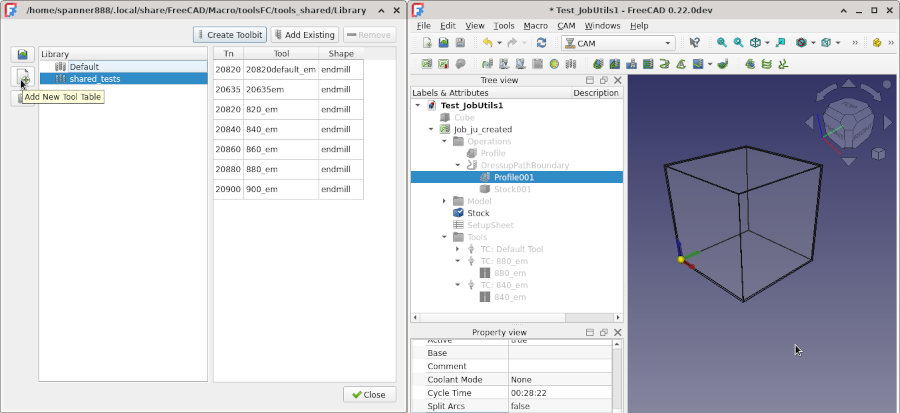
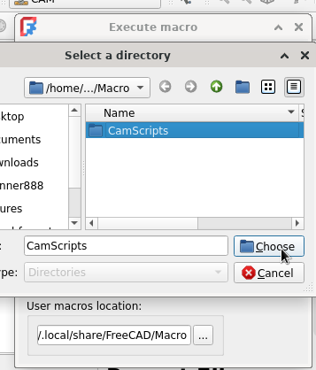
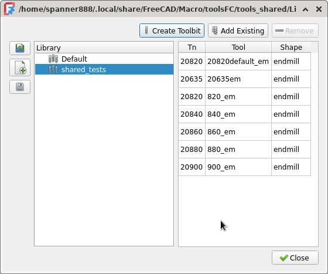

CAM Full Process blurb - Script 3.....

script Menu name<<<<<<<<<<<<<<<<<<<<<
CamFullProcessExample.py
CamScripts_3FullProcessExample.FcMacro

CamScripts_4READMEs.FcMacro
CamScripts_5Setup_CustomToolShapes.FcMacro
CamScripts_6Setup_CustomMaterialCfg.FcMacro


Script relies on two existing tool bits being in ??any or current?? of your Tool Library/s??
To create those....run menu ""
Script does not add any ToolBits to your Tool Library.


Materials Machinability data.
    FC now includes...

    Fz data from an older version of Tabellen.... is included in [mat file]() for Tool Materials HSS and Carbide, but only for the single Material Al.......
    This data has been limited due to differences through the data set to those in the above reference  2022 version.


Supported by 2 libraries of mine and Russ JobUtils
Details are provided in linked readmes and within the example scripts.
WARNING about using a Test lib!!!!

Scripts are very highly capable and tested, but there are limitations,
including your need to configure settings, naming rules and especially for #3 NAME, change the examples.
Limitations and minor bugs are documented ?????
Discussion can occur in forum thread [LINK]() and pull requests, bugs, issues, via this GITHUBREPO

Execution speed is reasonable, it can create & add several ToolBits per second, on old hardware.
Once I accidently created and 1600 Toolbits to a Library.
This took 20minutes????, but I think a lot of the slowness was debug prints at the time.

Example naming rules are in ...
Example csv file for import is in...
SHORT HERE!!!!!!


TWO sep release 1x end-end as EXAMPLE ...but note can use toolbits from....

vv-- OR becasue of the one dir focus, then one summary overview readme that links to 2x detaild ones...
sep MAJOR = bulk create/import...
    >>>ESP when "last" effort got 20K views...but sidetracked from the TB import/create!!!
...so split all the files apart....
    START WITH same repo...but dir for each
    BECASUE in GH/FC macros ONExdir .....???? try/maybe
BUT = MORE annoy to user as FC macro needs dir change........

study MD features+syntax - refine this!!

FIXME: numbering for "2. Set FreeCAD macro directory."
    ..& subsequent all = 1 !!!! <<<in ReText!!!

review 1st read me for missing stuff
    even if just some console output ...SNIPPETS???

# FreeCAD CAM scripting

Scripting all features of FreeCAD CAM for a complete end to end process:

* bulk import Tool Data to populate FreeCAD Tool Library

* create Job, Operations, ToolControllers

* set wide range properties

* assign ToolController to Operation

* use Tool & Material material-machinability cutting properties to calculate Spindle RPM

* create and save Sanity report to check for common errors

* postprocess Job to create and save gcode

All of the ToolBits were created and added to the Library shown in the left hand image below by `CamTbAddExample.FCMacro` and every item in the right hand image was created by `CamFullProcessExample.FcMacro`. An extensive number of properties were also set.

++anotyher file???
+++++++ the TB bulk creation is highly usefull in creating {??or importing??} TB and with a bit of community testing & refinement be ready for serious use. This tool only requires you to specify the tool or range of tool properties you need and any naming rules. There are a lot of settings, so this needs care and it would be safer to create and activate a test CAM Tool Table in your current Library before executing this script.

The other examples are fully functional, but require FcMacromore customisation of the code to match your specific needs.

 

# Installation

??4th = +github repo in
Select Menu - Preferences - Addon Manager: Then to "Custom Repositories" add github repo
???will this dump all into current macro dir...if so recommend create dir & set FC Macro dir to that dir first.

3 methods - addon manager (not yet avail)
    https://wiki.freecad.org/Addon#Information_for_developers
     add macro to Macros recipes page...automatically be picked up by Addon manager
    https://wiki.freecad.org/Macros_recipes

file copy
zip <<<<<<<<attached to forum = zip...or never attach forum  only link??


Before in addon repo
add my repo ...

after in addon repo - addon manager...

Manual - wiki link


`CamTbAddExample.FCMacro`

`CamFullProcessExample.FcMacro`.


# How to use

1. Required FreeCAD version:

A very recent development version of FreeCAD to run the Machionability RPM example for example FreeCAD revision 38314 or later.

If not, then Stable Version: 0.21.2.33771 (Git) works for the Creation of Job, Operations and TC, but not the Machinability RPM example.

2. Set FreeCAD macro directory.

Because the scripts and library files are supplied in a directory, the FreeCAD macro utility much be set to use that directory, as shown below:



If after setting the Macro directory and running one of the macros, you get an error in the report pane, like that shown below:


>>>UPDATE BELOW DUE TO FILE RENAMES!!!!!!!!!!!!!!!
```
    .....
    shiboken2/files.dir/shibokensupport/feature.py", line 139, in _import
    return original_import(name, *args, **kwarg
At present not all ToolBit properties are return when using Example 4. s)
           ^^^^^^^^^^^^^^^^^^^^^^^^^^^^^^^^^^^^^^
    <class 'ModuleNotFoundError'>: No module named 'CamTbAddLib'
```

Then try restarting FreeCAD to fix the issue.

3. Select CAM workbench and create a test library

Open CAM wb.

Create and empty Tool Table in your library so that tests ToolBits do not interfere with your "good" ToolBits.


If the CAM - ToolBit Library editor menu is greyed out, then you need to open or create any FreeCAD document. That document will not be changed.

4. Run default example scripts, or reconfigure and run.

The following sections briefly discuss each of the examples. Note by default all example except 4th in the first script will run.

One example script file is provided for each library, each containing several examples.

Both example files provide full automation, ie once user has set desired properties and actions, running each script requires no further user interaction.

TODO: remove what was last example 4 - no longer req - invisble mostly to user
        NB new last example needs doc - creates 1xTB for EVERY shape.

REDUCE to KISS/short generic - each example is on command call to the associated library, complete wtih example properties, either in the function call, or in variables prior.
>>>>>MAYBE EVEN THE **entire** SECTION MUCH SHORTER...keep the intro stuff, but shorten if poss, maybe skip some images??
You can run the examples as is, or modify the properties to suit your needs.
++Notes in the code.
In `CamFullProcessExample.FcMacro`, there is a fair bit of output printing that can be removed, if not required.
Also if you you remove features, be aware that later code might be dependant upon those outputs and fail. Sometimes you may be able to adjust the later code. For example removing one operation will cause related property value setting and assing a ToolController to fail.

????How to edit scripts and the libraries....
1. changing properties
2. add/remove calls to create TB, or add Operation to Job etc.
3. ...tailor libraries...

related FreeCAD CAM Terminology: ??just brief sentence& link?? [Machinability & RPM]()
.......

## Example output





13:16:27  Job Utilities 2024-02-25 module imported
13:16:27  CamTbAddLib (CAM ToolBit Add Library) V0.0.4  2024/09/16 module imported
13:16:27  CamScriptingLib (CAM Scripting Library) 2024-09-01 module imported
13:16:27  ToolBits created using tcProps1 & tcProps2 rely on the Toolbits from
13:16:27      CamTbAddExample, Examples 1 and 2.
13:16:27  --------------------------------------------------------------------------------
13:16:27  Example 1 JobUtils: New doc & Job, optionaly clear report/python panes.
			 Active document is Test_JobUtils with Job object
13:16:27  Example 2 JobUtils: Add profile operation to specified job.
			 adding profile operation using top face, Face6.
13:16:27  Example 3 JobUtils: Add profile operation & Boundary Dressup to specified job.
		 adding profile operation
13:16:27  adding boundary dressup on profile operation
13:16:27  --------------------------------------------------------------------------------
13:16:27  Example 4 JobUtils: Add ToolControllers to Job-Tools & desired Operation.
		 JobUtils... Available tool files:
13:16:27       3060 ::   6mm_Ball_End
13:16:27       4060 ::   6mm_Bullnose
13:16:27       5045 ::   45degree_chamfer
13:16:27       1 ::   5mm_Endmill
13:16:27       2 ::   5mm_Drill
13:16:27       3 ::   6mm_Ball_End
13:16:27       4 ::   6mm_Bullnose
13:16:27       5 ::   60degree_Vbit
13:16:27       6 ::   45degree_chamfer
13:16:27       7 ::   slittingsaw
13:16:27       8 ::   probe
13:16:27       9 ::   5mm-thread-cutter
13:16:27       1050 ::   5mm_Drill
13:16:27       2050 ::   5mm_Endmill
13:16:27       7500 ::   slittingsaw
13:16:27       20300 ::   2F_D0.3-L50.0_Pcb drill
13:16:27       22100 ::   2F_D2.1-L50.0_Pcb drill
13:16:27       22000 ::   4F_D2.0-L50.0_pcb corncutters
13:16:27       23000 ::   4F_D3.0-L50.0_pcb corncutters
13:16:27       22050 ::   0F_D2.05-L50.0_Pcb drill
13:16:27       22150 ::   2F_D2.15-L50.0_Pcb drill
13:16:27       22250 ::   2F_D2.25-L50.0_Pcb drill
13:16:27       22850 ::   2F_D2.85-L50.0_Pcb drill
13:16:27       22950 ::   2F_D2.95-L50.0_Pcb drill
13:16:27       20300 ::   2F_D0.3-L50.0_Pcb drill
13:16:27       26000 ::   4F_D6.0-L50.0_endmill
13:16:27       21500 ::   4F_D1.5-L50.0_endmill
13:16:27       22000 ::   4F_D2.0-L50.0_endmill
13:16:27       22500 ::   4F_D2.5-L50.0_endmill
13:16:27       23000 ::   4F_D3.0-L50.0_endmill
13:16:27       23500 ::   4F_D3.5-L50.0_endmill
13:16:27       24000 ::   4F_D4.0-L50.0_endmill
13:16:27       25000 ::   4F_D5.0-L50.0_endmill
13:16:27       25500 ::   4F_D5.5-L50.0_endmill
13:16:27       26000 ::   4F_D6.0-L50.0_endmill
13:16:27       21000 ::   1F_D1.0-L50.0_endmill
13:16:27       22000 ::   1F_D2.0-L50.0_endmill
13:16:27       20000 ::   2F_D0.0-L20.0_v-bit
13:16:27       23000 ::   4F_D3.0-L50.0_endmill
13:16:27       25000 ::   2F_D5.0-L50.0_endmill
13:16:27       21500 ::   4F_D1.5-L50.0_endmill
13:16:27       22000 ::   4F_D2.0-L50.0_endmill
13:16:27       22500 ::   4F_D2.5-L50.0_endmill
13:16:27       23000 ::   4F_D3.0-L50.0_endmill
13:16:27       23500 ::   4F_D3.5-L50.0_endmill
13:16:27       24000 ::   4F_D4.0-L50.0_endmill
13:16:27       24500 ::   4F_D4.5-L50.0_endmill
13:16:27       25000 ::   4F_D5.0-L50.0_endmill
13:16:27       25500 ::   4F_D5.5-L50.0_endmill
13:16:27       26000 ::   4F_D6.0-L50.0_endmill
13:16:27       20900 ::   2F_D0.9-L50.0_endmill
13:16:27       20000 ::   4F_D0.0-L54.2_dovetail
13:16:27       23175 ::   1F_D3.175-L50.0_endmill
13:16:27       23175 ::   2F_D3.175-L50.0_endmill
13:16:27       23175 ::   2F_D3.175-L50.0_endmill
13:16:27       21000 ::   2F_D1.0-L50.0_endmill
13:16:27       22000 ::   2F_D2.0-L50.0_endmill
13:16:27       23000 ::   2F_D3.0-L50.0_endmill
13:16:27       24000 ::   2F_D4.0-L50.0_endmill
13:16:27       25000 ::   2F_D5.0-L50.0_endmill
13:16:27       26000 ::   2F_D6.0-L50.0_endmill
13:16:27       25000 ::   2F_D5.0-L50.0_endmill
13:16:27       26000 ::   4F_D6.0-L50.0_endmill
13:16:27       26000 ::   4F_D6.0-L30.0_chamfer
13:16:27       24000 ::   4F_D4.0-L30.0_chamfer
13:16:27       26000 ::   3F_D6.0-L50.0_roughing
13:16:27       24000 ::   3F_D4.0-L50.0_roughing
13:16:27       22000 ::   2F_D2.0-L50.0_endmill
13:16:27       22500 ::   2F_D2.5-L50.0_endmill
13:16:27       23000 ::   2F_D3.0-L50.0_endmill
13:16:27       23000 ::   2F_D3.0-L50.0_endmill
13:16:27       24000 ::   2F_D4.0-L50.0_endmill
13:16:27       25000 ::   2F_D5.0-L50.0_endmill
13:16:27       26000 ::   2F_D6.0-L50.0_endmill
13:16:27       24000 ::   1F_D4.0-L50.0_endmill
13:16:27       23000 ::   1F_D3.0-L50.0_endmill
13:16:27       23000 ::   2F_D3.0-L50.0_slotdrill
13:16:27       24000 ::   2F_D4.0-L50.0_slotdrill
13:16:27       26000 ::   2F_D6.0-L50.0_slotdrill
13:16:27       24000 ::   1F_D4.0-L50.0_endmill
13:16:27       26000 ::   1F_D6.0-L50.0_endmill
13:16:27       28000 ::   1F_D8.0-L50.0_endmill
13:16:27       26000 ::   4F_D6.0-L50.0_ballend
13:16:27       36000 ::   2F_D16.0-L50.0_ballend
13:16:27       30000 ::   3F_D10.0-L30.0_chamfer
13:16:27       22000 ::   2F_D2.0-L50.0_endmill
13:16:27       23175 ::   2F_D3.175-L50.0_endmill
13:16:27       26100 ::   4F_D6.1-L50.0_endmill
13:16:27       21600 ::   4F_D1.6-L50.0_endmill
13:16:27       24100 ::   4F_D4.1-L30.0_chamfer
13:16:27       26400 ::   3F_D6.4-L50.0_roughing_HRangles
13:16:27       24200 ::   3F_D4.2-L50.0_roughing_HRangles
13:16:27       28120 ::   28120.0_8.12D_3F_endmill
13:16:27       1 ::   8.12_endmill
13:16:27       1 ::   Example1_string_name
13:16:27       26350 ::   26350.0_6.35D_4F_endmill
13:16:27       28200 ::   4F_D8.2-L50.0_endmill
13:16:27       28400 ::   4F_D8.4-L50.0_endmill
13:16:27       28600 ::   4F_D8.6-L50.0_endmill
13:16:27       28800 ::   4F_D8.8-L50.0_endmill
13:16:27       29000 ::   4F_D9.0-L50.0_endmill
13:16:27       33125 ::   33125.0_3.125D2F_0.0CL__HSS__Forward__30.0CL_50.0L_3.0DS_roughing_HRangles__312_roughing_HRangles_example
13:16:27       33250 ::   33250.0_3.25D2F_0.0CL__HSS__Forward__30.0CL_50.0L_3.0DS_roughing_HRangles__325_roughing_HRangles_example
13:16:27       33375 ::   33375.0_3.375D2F_0.0CL__HSS__Forward__30.0CL_50.0L_3.0DS_roughing_HRangles__337_roughing_HRangles_example
13:16:27       33500 ::   33500.0_3.5D2F_0.0CL__HSS__50.0L_ta119.0deg_pcb corncutters__350_pcb corncutters_example
13:16:27       33625 ::   33625.0_3.625D2F_0.0CL__HSS__50.0L_ta119.0deg_pcb corncutters__362_pcb corncutters_example
13:16:27       33750 ::   33750.0_3.75D2F_0.0CL__HSS__50.0L_ta119.0deg_pcb corncutters__375_pcb corncutters_example
13:16:27       33875 ::   33875.0_3.875D2F_0.0CL__HSS__Forward__30.0CL_50.0L_3.0DS_slotdrill__387_slotdrill_example
13:16:27       34000 ::   34000.0_4.0D2F_0.0CL__HSS__Forward__30.0CL_50.0L_3.0DS_slotdrill__400_slotdrill_example
13:16:27       34125 ::   34125.0_4.125D2F_0.0CL__HSS__Forward__30.0CL_50.0L_3.0DS_slotdrill__412_slotdrill_example
13:16:27       34250 ::   34250.0_4.25D2F_0.0CL__HSS__Forward__30.0CL_50.0L_3.0DS_roughing__425_roughing_example
13:16:27       34375 ::   34375.0_4.375D2F_0.0CL__HSS__Forward__30.0CL_50.0L_3.0DS_roughing__437_roughing_example
13:16:27       34500 ::   34500.0_4.5D2F_0.0CL__HSS__Forward__30.0CL_50.0L_3.0DS_roughing__450_roughing_example
13:16:27       34625 ::   34625.0_4.625D2F_0.0CL__HSS__50.0L_ta119.0deg_Pcb drill__462_Pcb drill_example
13:16:27       34750 ::   34750.0_4.75D2F_0.0CL__HSS__50.0L_ta119.0deg_Pcb drill__475_Pcb drill_example
13:16:27       34875 ::   34875.0_4.875D2F_0.0CL__HSS__50.0L_ta119.0deg_Pcb drill__487_Pcb drill_example
13:16:27       35000 ::   35000.0_5.0D2F_0.0CL__HSS__40.0CL_50.0L_3.0DS_ballend__500_ballend_example
13:16:27       35125 ::   35125.0_5.125D2F_0.0CL__HSS__40.0CL_50.0L_3.0DS_ballend__512_ballend_example
13:16:27       35250 ::   35250.0_5.25D2F_0.0CL__HSS__40.0CL_50.0L_3.0DS_ballend__525_ballend_example
13:16:27       35375 ::   35375.0_5.375D2F_0.0CL__HSS__40.0CL_1.5FR_50.0L_3.0DS_bullnose__537_bullnose_example
13:16:27       35500 ::   35500.0_5.5D2F_0.0CL__HSS__40.0CL_1.5FR_50.0L_3.0DS_bullnose__550_bullnose_example
13:16:27       35625 ::   35625.0_5.625D2F_0.0CL__HSS__40.0CL_1.5FR_50.0L_3.0DS_bullnose__562_bullnose_example
13:16:27       35750 ::   35750.0_5.75D2F_0.0CL__HSS__60.0deg_6.35CL_30.0L_6.35DS_td5.0deg_chamfer__575_chamfer_example
13:16:27       35875 ::   35875.0_5.875D2F_0.0CL__HSS__60.0deg_6.35CL_30.0L_6.35DS_td5.0deg_chamfer__587_chamfer_example
13:16:27       36000 ::   36000.0_6.0D2F_0.0CL__HSS__60.0deg_6.35CL_30.0L_6.35DS_td5.0deg_chamfer__600_chamfer_example
13:16:27       36125 ::   36125.0_6.125D2F_0.0CL__HSS__60.0deg_9.0CL_54.2L_8.0ND_5.0NH_9.53DS_td5.0deg_dovetail__612_dovetail_example
13:16:27       36250 ::   36250.0_6.25D2F_0.0CL__HSS__60.0deg_9.0CL_54.2L_8.0ND_5.0NH_9.53DS_td5.0deg_dovetail__625_dovetail_example
13:16:27       36375 ::   36375.0_6.375D2F_0.0CL__HSS__60.0deg_9.0CL_54.2L_8.0ND_5.0NH_9.53DS_td5.0deg_dovetail__637_dovetail_example
13:16:27       36500 ::   36500.0_6.5D2F_0.0CL__HSS__50.0L_ta119.0deg_drill__650_drill_example
13:16:27       36625 ::   36625.0_6.625D2F_0.0CL__HSS__50.0L_ta119.0deg_drill__662_drill_example
13:16:27       36750 ::   36750.0_6.75D2F_0.0CL__HSS__50.0L_ta119.0deg_drill__675_drill_example
13:16:27       36875 ::   36875.0_6.875D2F_0.0CL__HSS__Forward__30.0CL_50.0L_3.0DS_endmill__687_endmill_example
13:16:27       37000 ::   37000.0_7.0D2F_0.0CL__HSS__Forward__30.0CL_50.0L_3.0DS_endmill__700_endmill_example
13:16:27       37125 ::   37125.0_7.125D2F_0.0CL__HSS__Forward__30.0CL_50.0L_3.0DS_endmill__712_endmill_example
13:16:27       37250 ::   37250.0_7.25D2F__50.0L_probe__725_probe_example
13:16:27       37375 ::   37375.0_7.375D2F__50.0L_probe__737_probe_example
13:16:27       37500 ::   37500.0_7.5D2F__50.0L_probe__750_probe_example
13:16:27       37625 ::   37625.0_7.625D2F_0.0CL__HSS__bt3.0__50.0L_19.05DS_slittingsaw__762_slittingsaw_example
13:16:27       37750 ::   37750.0_7.75D2F_0.0CL__HSS__bt3.0__50.0L_19.05DS_slittingsaw__775_slittingsaw_example
13:16:27       37875 ::   37875.0_7.875D2F_0.0CL__HSS__bt3.0__50.0L_19.05DS_slittingsaw__787_slittingsaw_example
13:16:27       38000 ::   38000.0_8.0D2F_0.0CL__HSS__60.0deg_50.0L_3.0ND_20.0NL_5.0DS_thread-mill__800_thread-mill_example
13:16:27       38125 ::   38125.0_8.125D2F_0.0CL__HSS__60.0deg_50.0L_3.0ND_20.0NL_5.0DS_thread-mill__812_thread-mill_example
13:16:27       38250 ::   38250.0_8.25D2F_0.0CL__HSS__60.0deg_50.0L_3.0ND_20.0NL_5.0DS_thread-mill__825_thread-mill_example
13:16:27       38375 ::   38375.0_8.375D2F_0.0CL__HSS__90.0deg_1.0CL_20.0L_5.0DS_td1.0deg_v-bit__837_v-bit_example
13:16:27       38500 ::   38500.0_8.5D2F_0.0CL__HSS__90.0deg_1.0CL_20.0L_5.0DS_td1.0deg_v-bit__850_v-bit_example
13:16:27       38625 ::   38625.0_8.625D2F_0.0CL__HSS__90.0deg_1.0CL_20.0L_5.0DS_td1.0deg_v-bit__862_v-bit_example
13:16:27       30300 ::   4F_D10.3-L50.0_endmill
13:16:27       1 ::   5mm_Endmill
13:16:27       2 ::   5mm_Drill
13:16:27       3 ::   6mm_Ball_End
13:16:27       4 ::   6mm_Bullnose
13:16:27       5 ::   60degree_Vbit
13:16:27       6 ::   45degree_chamfer
13:16:27       7 ::   slittingsaw
13:16:27       8 ::   probe
13:16:27       9 ::   5mm-thread-cutter
13:16:27       8060 ::   60degree_Vbit
13:16:27
13:16:27  Using Helix/Rake angle test ToolBit 3F_D6.4-L50.0_roughing_HRangles.
13:16:27  Add TC using toolname: '3F_D6.4-L50.0_roughing_HRangles' and set h/v feeds & spindle speed.
13:16:27  User Tool shapeDir:  has 5 shapes in: /home/spanner888/.local/share/FreeCAD/Macro/Tools/Shape/
13:16:27  System Tool shapeDir:  has 10 shapes in: /tmp/.mount_FC_wklQf8X7P/usr/Mod/CAM/Tools/Shape/
13:16:28  Set profile_op.ToolController to above TC+user scripted settings
13:16:28  Add TC using tool#: '26350' and set h/v feeds & spindle speed.
13:16:28  	Set profile_op1.ToolController to above TC+user scripted settings
13:16:29  --------------------------------------------------------------------------------
13:16:29  Example 5 csl: Job-Operation & TC props + Machinability data to calculate:
		    RPM, Vf(hor feed), Power, cutting torque
13:16:29  ToolBit Test_JobUtils#_F_D6_4_L50_0_roughing_HRangles has HelixAngle, using value: 17.2 deg
13:16:29  ToolBit Test_JobUtils#_F_D6_4_L50_0_roughing_HRangles has RakeAngle, using value: 29.9 deg
13:16:29  material : HardWood
13:16:29
13:16:29  mat inf:  Machining/HardWood.FCMat
					 System /tmp/.mount_FC_wklQf8X7P/usr/share/Mod/Material/Resources/Materials
13:16:29  parent inf: Appearance/Wood.FCMat System /tmp/.mount_FC_wklQf8X7P/usr/share/Mod/Material/Resources/Materials
13:16:29  Using SurfaceSpeedHSS: 10000.0 mm/s
13:16:29  Using default fz: 0.03 mm
13:16:29  INFO: Limiting Calculated RPM of 29842 to max setting of 20000.
13:16:29  electrical spindle power  0.215 kW
13:16:29  Mc cutting torque 0.08717 Nm
13:16:29  vf  1800 mm/min
13:16:29  mrr  576 mm^3/s
13:16:29
13:16:29  ToolBit Test_JobUtils#_F_D6_4_L50_0_roughing_HRangles has HelixAngle, using value: 17.2 deg
13:16:29  ToolBit Test_JobUtils#_F_D6_4_L50_0_roughing_HRangles has RakeAngle, using value: 29.9 deg
13:16:29  material : AluminumWroughtAlloy
13:16:29
13:16:29  mat inf:  Machining/AluminumWroughtAlloy.FCMat
					 System /tmp/.mount_FC_wklQf8X7P/usr/share/Mod/Material/Resources/Materials
13:16:29  parent inf: Appearance/Aluminum.FCMat System /tmp/.mount_FC_wklQf8X7P/usr/share/Mod/Material/Resources/Materials
13:16:29  Using SurfaceSpeedHSS: 2000.0 mm/s
13:16:29  Using default fz: 0.03 mm
13:16:29  electrical spindle power  0.313 kW
13:16:29  Mc cutting torque 0.42589 Nm
13:16:29  vf  537 mm/min
13:16:29  mrr  172 mm^3/s
13:16:29
13:16:29  ToolBit Test_JobUtils#_F_D6_4_L50_0_roughing_HRangles has HelixAngle, using value: 17.2 deg
13:16:29  ToolBit Test_JobUtils#_F_D6_4_L50_0_roughing_HRangles has RakeAngle, using value: 29.9 deg
13:16:29  material : AlCastAlloyINHERITED+fz
13:16:29
13:16:29  mat inf:  Material/Machining/AlCastAlloyINHERITED+fz.FCMat
					 Custom /home/spanner888/.local/share/FreeCAD/Mod/CamScripts/freecad/cam_scripts/cutting_tool_data/Resources
13:16:29  parent inf: Machining/AluminumCastAlloy.FCMat System /tmp/.mount_FC_wklQf8X7P/usr/share/Mod/Material/Resources/Materials
13:16:29  Vc array data [[0.0, 1333.3333333333335 mm/s], [1.0, 2000.0000000000002 mm/s], [2.0, 516.6666666666667 mm/s]]
13:16:29  Vc for Tool Mat: HSS  is:  1333.3333333333335 mm/s 1333.3333333333335 mm/s
13:16:29
13:16:29  Fz.Array data:
13:16:29  	 HSS [0.0, -0.00020581, 0.00861056, -0.03485845]
13:16:29  	 Carbide [1.0, -0.00024088, 0.00965887, -0.037093]
13:16:29  	 HSS coated [2.0, 0.0, 0.0, 0.0]
13:16:29  Calculated Fz for Tool Mat: HSS  is:  0.011819156400000003 mm
13:16:29
13:16:29  electrical spindle power  0.153 kW
13:16:29  Mc cutting torque 0.31204 Nm
13:16:29  vf  141 mm/min
13:16:29  mrr  45 mm^3/s
13:16:29  --------------------------------------------------------------------------------
13:16:29  Example 6 csl: Create & save: CAM Sanity check report & Postprocessed gcode.
		 Processing file outputs: Sanity Job common errors report & PostProcess Gcode
13:16:30  Sanity check report written to: /home/spanner888/.local/share/FreeCAD/Macro/CAM_sanity_check.html
13:16:30
13:16:30  Post Processor: script_module postprocessing...
13:16:30  Done postprocessing.
13:16:30  File written to /home/spanner888/.local/share/FreeCAD/Macro/Test_JobUtils_Job_ju_created____0.ngc
13:16:30  --------------------------------------------------------------------------------
13:16:30  CamFullProcessExample.FcMacro finished.


