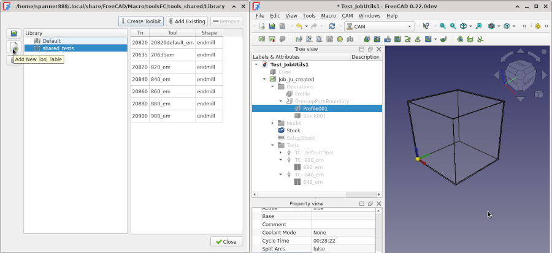
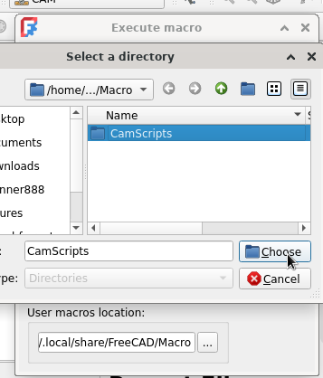
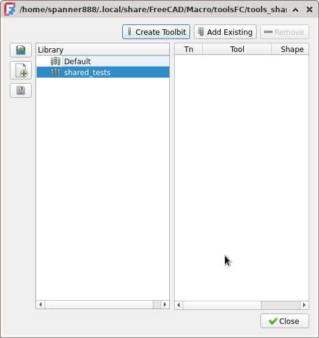
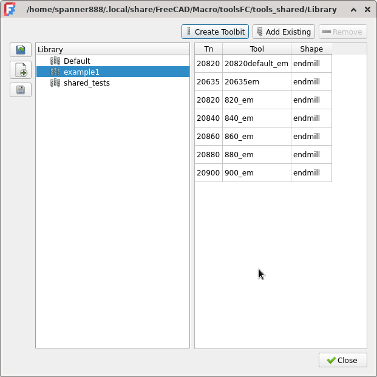
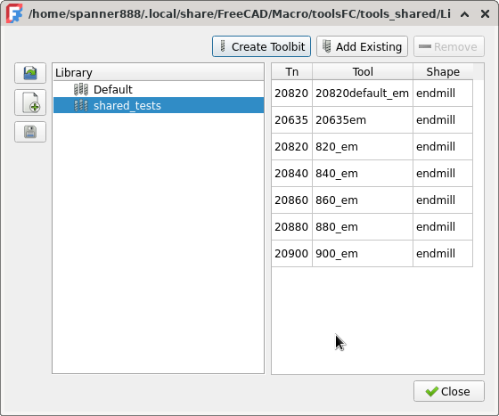

study MD features+syntax - refine this!!

FIXME: numbering for "2. Set FreeCAD macro directory."
    ..& subsequent all = 1 !!!! <<<in ReText!!!

review 1st read me for missing stuff
    even if just some console output ...SNIPPETS???

# FreeCAD CAM scripting

Scripting all features of FreeCAD CAM for a complete end to end process:

* bulk import Tool Data to populate FreeCAD Tool Library

* create Job, Operations, ToolControllers

* set wide range properties

* assign ToolController to Operation

* use Tool & Material material-machinability cutting properties to calculate Spindle RPM

* create and save Sanity report to check for common errors

* postprocess Job to create and save gcode

All of the ToolBits were created and added to the Library shown in the left hand image below by `CamLibTbAddExample.FCMacro` and every item in the right hand image was created by `CamFullProcessExample.FcMacro`. An extensive number of properties were also set.

++anotyher file???
+++++++ the TB bulk creation is highly usefull in creating {??or importing??} TB and with a bit of community testing & refinement be ready for serious use. This tool only requires you to specify the tool or range of tool properties you need and any naming rules. There are a lot of settings, so this needs care and it would be safer to create and activate a test CAM Tool Table in your current Library before executing this script.

The other examples are fully functional, but require more customisation of the code to match your specific needs.

 

# Installation

??4th = +github repo in
Select Menu - Preferences - Addon Manager: Then to "Custom Repositories" add github repo
???will this dump all into current macro dir...if so recommend create dir & set FC Macro dir to that dir first.

3 methods - addon manager (not yet avail)
    https://wiki.freecad.org/Addon#Information_for_developers
     add macro to Macros recipes page...automatically be picked up by Addon manager
    https://wiki.freecad.org/Macros_recipes

file copy
zip <<<<<<<<attached to forum = zip...or never attach forum  only link??


Before in addon repo
add my repo ...

after in addon repo - addon manager...

Manual - wiki link


`CamLibTbAddExample.FCMacro`

`CamFullProcessExample.FcMacro`.


# How to use

1. Required FreeCAD version:

A very recent development version of FreeCAD to run the Machionability RPM example for example FreeCAD revision 38314 or later.

If not, then Stable Version: 0.21.2.33771 (Git) works for the Creation of Job, Operations and TC, but not the Machionability RPM example.

2. Set FreeCAD macro directory.

Because the scripts and library files are supplied in a directory, the FreeCAD macro utility much be set to use that directory, as shown below:



If after setting the Macro directory and running one of the macros, you get an error in the report pane, like that shown below:

```
    .....
    shiboken2/files.dir/shibokensupport/feature.py", line 139, in _import
    return original_import(name, *args, **kwarg
At present not all ToolBit properties are return when using Example 4. s)
           ^^^^^^^^^^^^^^^^^^^^^^^^^^^^^^^^^^^^^^
    <class 'ModuleNotFoundError'>: No module named 'CamLibTbAdd'
```

Then try restarting FreeCAD to fix the issue.

3. Select CAM workbench and create a test library

Open CAM wb.

Create and empty Tool Table in your library so that tests ToolBits do not interfere with your "good" ToolBits.



If the CAM - ToolBit Library editor menu is greyed out, then you need to open or create any FreeCAD document. That document will not be changed.

4. Run default example scripts, or reconfigure and run.

The following sections briefly discuss each of the examples. Note by default all example except 4th in the first script will run.

One example script file is provided for each library, each containing several examples.

Both example files provide full automation, ie once user has set desired properties and actions, running each script requires no further user interaction.


REDUCE to KISS/short generic - each example is on command call to the associated library, complete wtih example properties, either in the function call, or in variables prior.
>>>>>MAYBE EVEN THE **entire** SECTION MUCH SHORTER...keep the intro stuff, but shorten if poss, maybe skip some images??
You can run the examples as is, or modify the properties to suit your needs.
++Notes in the code.
In `CamFullProcessExample.FcMacro`, there is a fair bit of output printing that can be removed, if not required.
Also if you you remove features, be aware that later code might be dependant upon those outputs and fail. Sometimes you may be able to adjust the later code. For example removing one operation will cause related property value setting and assing a ToolController to fail.

????How to edit scripts and the libraries....
1. changing properties
2. add/remove calls to create TB, or add Operation to Job etc.
3. ...tailor libraries...

related FreeCAD CAM Terminology: ??just brief sentence& link?? [Machinability & RPM]
.......

## Example output






```
19:38:25  Adding ToolBit Shape: endmill Name: 20820default_em, #20820.0, Dia: 8.2 mm
19:38:25  ...finished.
19:38:25
19:38:25  Adding ToolBit Shape: endmill Name: 20635em, #20635.0, Dia: 6.35 mm
19:38:25  ...finished.
19:38:25
19:38:25  ToolBit diameters to be created:  [8.2 8.4 8.6 8.8 9. ]
19:38:25  Adding ToolBit Shape: endmill Name: 820_em, #20820, Dia: 8.2 mm
19:38:25  Adding ToolBit Shape: endmill Name: 840_em, #20840, Dia: 8.4 mm
19:38:25  Adding ToolBit Shape: endmill Name: 860_em, #20860, Dia: 8.6 mm
19:38:25  Adding ToolBit Shape: endmill Name: 880_em, #20880, Dia: 8.8 mm
19:38:25  Adding ToolBit Shape: endmill Name: 900_em, #20900, Dia: 9.0 mm
19:38:25  ...finished.
```


CamLibTbAdd Library

Example 1. Add single example default endmill to current Library.

Example 2. Add SINGLE Tool 6.35 mm dia to current library

Example 3. Create range of tools from dia to dia_max, incrementing dia by dia_inc
   But only If BOTH dia_max & dia_inc are greater than zero,
           Else: ONLY create ONE TB of this dia in current library.

Example 4. Retrieve properties & attributes of all shape files in FC Tool- Shape directory.
By default this example is disabled.
Change the value of the line:

    ```getDefaultShapeAttrs = False```

to

    ```getDefaultShapeAttrs = True```

and save the macro to run this example. Then the shape dictionaries output in report pane can be used to create different types of ToolBits above.

An example is shown below:

```
{'shape': 'v-bit.fcstd', 'name': 'v-bit', 'parameter': {'CuttingEdgeAngle': 90.0 deg, 'CuttingEdgeHeight': 1.0 mm, 'Diameter': 10.0 mm, 'Length': 20.0 mm, 'ShankDiameter': 5.0 mm, 'TipDiameter': 1.0 mm}, 'attribute': {'Chipload': 0.0 mm, 'Flutes': 0, 'Material': 'HSS'}}
```

The output above includes all properties in the default shapes, as a patch suggested to fix missing properties has been applied locally. Details of the issue and a suggested fix have been submitted in FreeCAD/FreeCAD#15637.

FreeCAD CAM Tools/Bits/Shapes/Library Job-TC ++ for ju - Ops/materials/SF...

CHANGE TO ABOVE KISS FORMAT/DETAILS!!!!
so sev sections WITH Example NUMBERING????

## Example output


```
19:43:01  Job Utilities 2024-02-25 module imported
19:43:01  --------------------------------------------------------------------------------
19:43:01  Example 1 JobUtils: New doc & Job, optionaly clear report/python panes.
			 Active document is Test_JobUtils with Job object
19:43:06  Example 2 JobUtils: Add profile operation to specified job.
			 adding profile operation using top face, Face6.
19:43:06  Example 3 JobUtils: Add profile operation & Boundary Dressup to specified job.
		 adding profile operation
19:43:06  adding boundary dressup on profile operation
19:43:06  --------------------------------------------------------------------------------
19:43:06  Example 4 JobUtils: Add ToolControllers to Job-Tools & desired Operation.
		 JobUtils... Available tool files:
19:43:06       1 ::   5mm_Endmill
19:43:06       2 ::   5mm_Drill
19:43:06       3 ::   6mm_Ball_End
19:43:06       4 ::   6mm_Bullnose
19:43:06       5 ::   60degree_Vbit
19:43:06       6 ::   45degree_chamfer
19:43:06       7 ::   slittingsaw
19:43:06       8 ::   probe
19:43:06       9 ::   5mm-thread-cutter
19:43:06       20820.0 ::   20820default_em
19:43:06       20635.0 ::   20635em
19:43:06       20820 ::   820_em
19:43:06       20840 ::   840_em
19:43:06       20860 ::   860_em
19:43:06       20880 ::   880_em
19:43:06       20900 ::   900_em
19:43:06
19:43:06  Add TC using toolname: 880_em and set h/v feeds & spindle speed.
19:43:11  	Set profile_op.ToolController to above TC+user scripted settings
19:43:11  Add TC using tool#: 20840 and set h/v feeds & spindle speed.
19:43:11  	Set profile_op1.ToolController to above TC+user scripted settings
19:43:15  --------------------------------------------------------------------------------
19:43:15  Example 5 CamScripting: Machinability & SpindleSpeed RPM calculation:
		 Retrieved Stock Material SurfaceSpeeds & tc1 Diameter
			in common base Units of mm/s & mm, to Calculate cutting RPM
19:43:15  		HSS: 2916.67 mm/s, CBD: 6483.33 mm/s, TC1 dia: 8.8 mm
19:43:15  	**Calculated** RPM for HSS tool is 6330.0 RPM
19:43:15  	formula: SurfaceSpeed / (Diameter * math.pi)
19:43:15  	NB: FreeCAD Units are all normalised in metric, so SurfaceSpeed*1000 is not required.
19:43:15  Calculated SpindleSpeed RPM has not been set in ToolController SpindleSpeed.
19:43:15  You can do this manualy, or uncomment code in line below this print statement in the macro.
19:43:15  --------------------------------------------------------------------------------
19:43:15  Example 6 CamScripting: Create & save: CAM Sanity check report & Postprocessed gcode.
		 Processing file outputs: Sanity Job common errors report & PostProcess Gcode
19:43:16  Sanity check report written to: /home/spanner888/Documents/cam_sanity/sanity_auto.html
19:43:16
19:43:17  Post Processor: script_module postprocessing...
19:43:17  Done postprocessing.
19:43:17  File written to /home/spanner888/Documents/_source/_APPS/FC_wkly_38334/squashfs-root/appd_mlappy/Test_JobUtils1_Job_ju_created____0.ngc
19:43:19  --------------------------------------------------------------------------------
```

## Limitations & Issues

SEVERAL ALREADY ABOVE ...just remove the section????
See the github repo issues for latest information.

# Credits????
The two scripts and

The third library which provides most of the core Job features for `CamFullProcessExample.FcMacro` was created by Russ..
Excelent example code is provided in this library in the Test## functions.

++ He worked on CAM changes to make scripting have less user intervention to answer dialogs...???

Path and Material developers and forum users including Russ, onekk, CSV guy...

# Background informatiion

## FreeCAD CAM Terminology:
ToolBitLibrary: provides way to manage many libraries each with many Tools
  all organised/grouped as desired. eg Same TooBit can be in many Library-Tool-Tables.
  Each Library contains Tool Tables with ROWS of: Tn/Tool/Shape.
Tool-Bit = a cutting tool, with defined Shape properties,
      including a property for the underlying Tool-Shape file
      & other Tool-bit Properties such as number of flutes.
      The Tool-Bit shape is used in Operations and Simulators to
      "cut" the stock material to desired shape & size.
Tool-Shape file contains a sketch profile of cutting tool,
  with default Paramatised shape dimensions,
  that are updated from Tool-Bit properties.
Job-ToolController has properties for Rapids, Feeds, Speed
  and contains copy of the Tool-Bit used with all the specific sizes/properties.

## Machinability & RPM

The early work using the new Materials Workbench to add default group of "Machining" materials that have "Machinability" properties is also demonstrated in the second script 'CamFullProcessExample.FcMacro'.

Spindle RPM is calculated, by retreiving ToolController material type of HSS or Carbide and then retreiving the corresponding HSS or Carbide surfaceSpeed from the Material data of the Job-Stock, which would be inherited from the design object.

Note "ToolController material type" is an existing ToolController property and is not a "new Material", but maybe in future, [follow or join the design process]()

??This a demonstration of the very early work to design Speeds and Feeds for FreeCAD. SEE XXXXX
In future the ToolController material, might be set via a "new Material", depending on how we all decide to progress Speeds and Feeds.


Note: The cutting machinability data and calculated RPM are real, usable values, but are not yet matched with background information on the expected machine capability and limitations. For example is the cutting machine:
* a very rigid milling machine, with 20kW spindle @20,000 RPM (as seen in many tool catalogs)
* a commercial hobby machine, by comparison not as rigid & maybe 1kW spindle @10,000 RPM
* a DIY milling machine with even less capability & rigidity
* a commercial/DIY routing machine, great for timber, plastics, but stretched to cut metals
* one of the many types of 3040 Engraver have even less ability than above

Implied by above is the need to adapt the cutting parameters such as Spindle RPM to the situation.

This is also demonstrated in Tool catalogs by all of the footnotes and asterix and appendix that provide some guidance on how to change the cutting parameters for a wide variety of situations.

These catalogs usually state that the data is "starting values" or some "maximum values" and maybe other

## References
* FreeCAD Forum announcement/discussion [thread](https://forum.freecadweb.org/viewtopic.php?f=3&t=60818)
* JobUtils.py Library Russ's lib Forum announcement/discussion [thread](https://forum.freecadweb.org/viewtopic.php?f=3&t=60818)
...all the materials

## Credits????
The two scripts containing examples each kept simple by use of a related library.

The third library provides many of the core Job features for `CamFullProcessExample.FcMacro` was created by Russ..
Excelent example code is provided in this library in the Test## functions.
Those exapmles have been included here and extended with many other features to give the full scripted end to end CAM process.

??++ He also worked on CAM changes to make scripting have less user intervention to answer dialogs...???

Path and Material developers and forum users including Russ, onekk, CSV guy...

## References
* FreeCAD Forum announcement/discussion [thread](https://forum.freecadweb.org/viewtopic.php?f=3&t=60818)
* JobUtils.py Library Russ's lib Forum announcement/discussion [thread](https://forum.freecadweb.org/viewtopic.php?f=3&t=60818)
...all the materials

# Release notes:

* V0.1  2024-08-08:  Initial release
    * Initial release, 2 scripts/macros with 3 libraries and support information.
    * Scripting all features of FreeCAD CAM for a complete end to end process

* V0.1  2024-08-16: Initial release
                    - creates start to finish FreeCAD CAM process
                    - 2 scripts/macros, 3 libraries & support information.

* V0.1  2024-08-16: Initial release
            - creates start to finish FreeCAD CAM process
            - 2 scripts/macros, 3 libraries & support information.

* V0.1  2024-08-16:
            - Initial release
            - creates start to finish FreeCAD CAM process
            - 2 scripts/macros, 3 libraries & support information.

* V0.1  2024-08-16:
            - Initial release
            - creates start to finish FreeCAD CAM process
            - 2 scripts/macros, 3 libraries & support information.

* V0.1  2024-08-16:
            - Initial release
            - creates start to finish FreeCAD CAM process
            - 2 scripts/macros, 3 libraries & support information.

* V0.1  2024-08-16:
            - Initial release
            - creates start to finish FreeCAD CAM process
            - 2 scripts/macros, 3 libraries & support information.

## License
LGPL-2.1-or-later (see [LICENSE](LICENSE))
