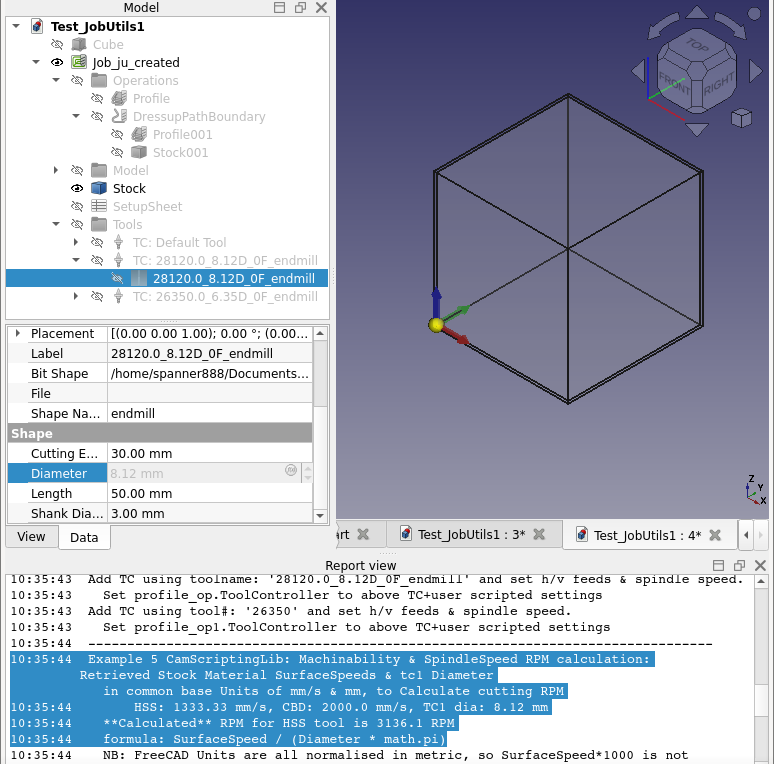

study MD features+syntax - refine this!!

# FreeCAD CAM scripting

Scripting all features of FreeCAD CAM for a complete end to end process:
* bulk import Tool Data to populate FreeCAD Tool Library
* create Job, Operations, ToolControllers
* set wide range properties
* assign ToolController to Operation
* use Tool & Material material-machinability cutting properties to calculate Spindle RPM
* create and save Sanity report to check for common errors
* postprocess Job to create and save gcode

Every item in the two images below was created by the two attached scripts: `CamLibTbAddExample.FCMacro` and `CamFullProcessExample.FcMacro`.

Not shown in above images are calculated Spindle RPM, the Sanity check report and the created gcode.

The early work using the new Materials Workbench to add default group of "Machining" materials that have "Machinability" properties is also demonstrated in the second script `CamFullProcessExample.FcMacro`.

More detail and background is in [Machinability & RPM].

# Installation & Doco/instructions/Usage

how to install ....
Before in addon repo
add my repo ...

after in addon repo - addon manager...

Manual - wiki link

`CamLibTbAddExample.FCMacro`

`CamFullProcessExample.FcMacro`.

How to run.....

3x libraries:
first JU....

2 additonal libraries...
CamScripting Library extend Tool bulk creation, RPM calculation, Sanity report and postprocessing to create gcode.

More details on each script is in the following sections.

# Example       ??top level or under Install
One example file is provided for each library, each containing several examples.

Both example files provide full automation, ie once user has set desired properties and actions, running each script requires no further user interaction.

## CamLibTbAdd Library

### Example 1. Add single example default endmill to current Library.

### Example 2. Add SINGLE Tool 6.35 mm dia to current library

### Example 3. Create range of tools from dia to dia_max, incrementing dia by dia_inc
   But only If BOTH dia_max & dia_inc are greater than zero,
           Else: ONLY create ONE TB of this dia in current library.

### Example 4. Retrieve properties & attributes of all shape files in FC Tool- Shape directory.
By default this example is disabled.
Change the value of getDefaultShapeAttrs to True and save the macro to run this example.
These can be used to create different types of ToolBits above.
Get FreeCAD Default shape directory & list of shape names in dir.

???+FC report outout

## FreeCAD CAM Tools/Bits/Shapes/Library Job-TC ++ for ju - Ops/materials/SF...
so sev sections WITH Example NUMBERING????

???+FC report outout

++Note: These example/steps require preconditions to work. The easiest was ensure the preconditions are met is to run the entire script.??????

How to edit scripts and the libraries....
1. changing properties
2. add/remove calls to create TB, or add Operation to Job etc.
3. ...tailor libraries...

related FreeCAD CAM Terminology: ??just brief sentence& link?? [Machinability & RPM]
.......

# Credits????
The two scripts and

The third library which provides most of the core Job features for `CamFullProcessExample.FcMacro` was created by Russ..
Excelent example code is provided in this library in the Test## functions.

++ He worked on CAM changes to make scripting have less user intervention to answer dialogs...???

Path and Material developers and forum users including Russ, onekk, CSV guy...

# Background informatiion

## Machinability & RPM

The early work using the new Materials Workbench to add default group of "Machining" materials that have "Machinability" properties is also demonstrated in the second script 'CamFullProcessExample.FcMacro'.

Spindle RPM is calculated, by retreiving ToolController material type of HSS or Carbide and then retreiving the corresponding HSS or Carbide surfaceSpeed from the Material data of the Job-Stock, which would be inherited from the design object.

Note "ToolController material type" is an existing ToolController property and is not a "new Material", but maybe in future, [follow or join the design process]()

Note: The cutting machinability data and calculated RPM are real, usable values, but are not yet matched with background information on the expected machine capability and limitations. For example is the cutting machine:
* a very rigid milling machine, with 20kW spindle @20,000 RPM (as seen in many tool catalogs)
* a commercial hobby machine, by comparison not as rigid & maybe 1kW spindle @10,000 RPM
* a DIY milling machine with even less capability & rigidity
* a commercial/DIY routing machine, great for timber, plastics, but stretched to cut metals
* one of the many types of 3040 Engraver have even less ability than above

Implied by above is the need to adapt the cutting parameters such as Spindle RPM to the situation.

This is also demonstrated in Tool catalogs by all of the footnotes and asterix and appendix that provide some guidance on how to change the cutting parameters for a wide variety of situations.

These catalogs usually state that the data is "starting values" or some "maximum values" and maybe other

## References
* FreeCAD Forum announcement/discussion [thread](https://forum.freecadweb.org/viewtopic.php?f=3&t=60818)
* JobUtils.py Library Russ's lib Forum announcement/discussion [thread](https://forum.freecadweb.org/viewtopic.php?f=3&t=60818)
...all the materials

# Release notes:

* V0.1  2024-08-08:  Initial release
    * really short key features ...mostly setting how to do for next releases!!!

## License
LGPL-2.1-or-later (see [LICENSE](LICENSE))
